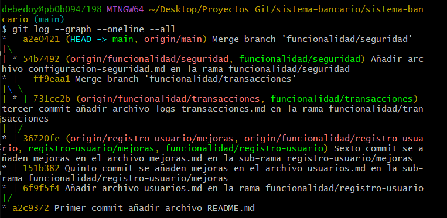

# Sistema Bancario

# M1-GIT-S2
# **Taller: Sistema Bancario con Múltiples Funcionalidades**
> **Larry M. Ramírez - Coach Tecnico**

# Objetivo.

Los asistentes configurarán un repositorio remoto en GitHub, aplicando gestión de ramas, creación de merges y realizando la resolución de conflictos.

# Instrucciones.

-   Se debe crear un repositorio remoto en GitHub llamado ‘sistema-bancario’, dicho repositorio debe ser clonado en la máquina local y después de cada cambio se debe mantener actualizado el repositorio remoto.     
-   En la rama main se debe crear un archivo README.md.
-   A partir de este punto se deben crear ramas para diferentes funcionalidades, en cada rama debe existir un archivo .md que represente el contenido de la rama en cuestión, ej: 
> - ‘funcionalidad/registro-usuario’ - usuarios.md 
> - ‘funcionalidad/transacciones’ - logs-transacciones.md
> - ‘funcionalidad/seguridad’ - configuracion-seguridad.md

-   Crear una rama a partir de alguna de las ramas creadas en el punto anterior, editar el archivo que contiene y realizar merge a la rama original. 
- Hacer merge de todas las ramas creadas a la rama main.
- Tomar una captura de pantalla de los logs, subirla al repositorio y mostrarla en la página principal por medio del archivo README.md.

**NOTA**: Cada acción realizada se debe reflejar en su respectivo commit correctamente nombrado.

