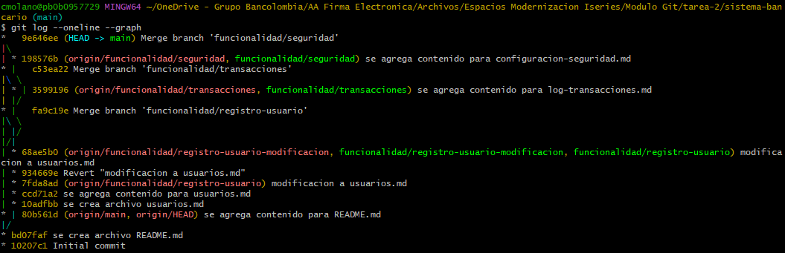

Descripción
Esta funcionalidad permite a los usuarios gestionar sus cuentas bancarias a través de una interfaz amigable. Incluye operaciones básicas como la creación de cuentas, consulta de saldos, transferencias, pagos de servicios y generación de estados de cuenta.

Logs 