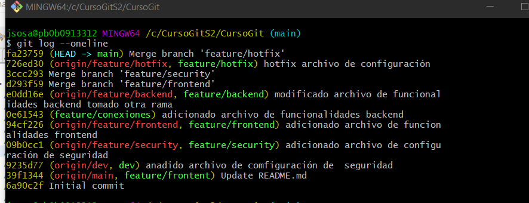

# M1-GIT-S3
# Taller: Sistema Bancario con Múltiples Funcionalidades 2
> **Larry M. Ramírez - Coach Técnico**

# Objetivo.
Los asistentes configurarán un repositorio remoto en GitHub, aplicando gestión de ramas, manejando comandos avanzados de Git y utilizando pull request para el manejo de code review.

# Instrucciones.

# CursoGit
curso sofka

# Prueba de actualización desde git hub 

jose mauricio sosa lopez

